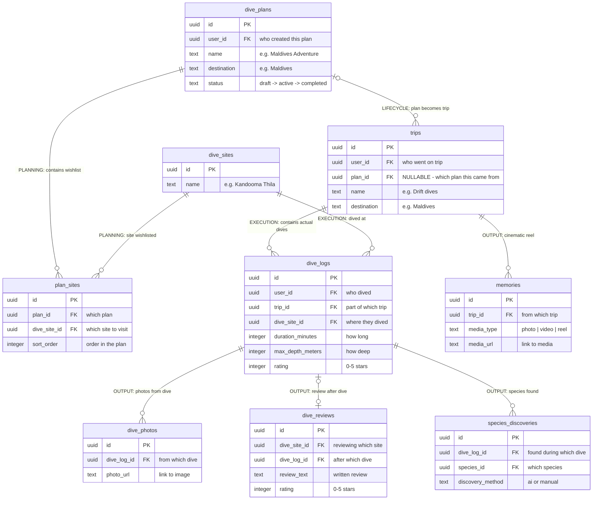
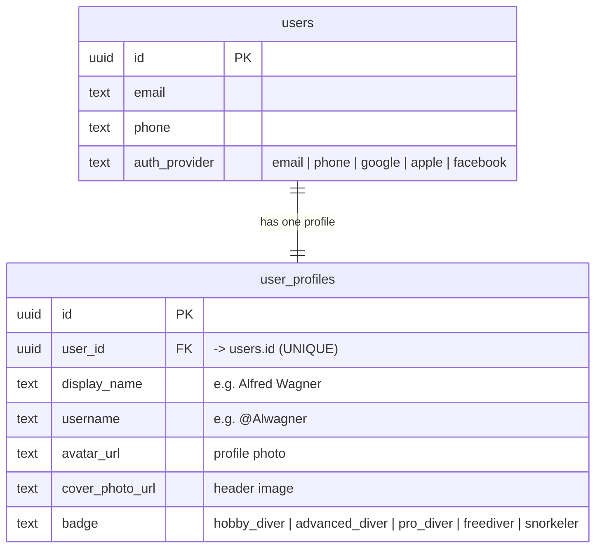
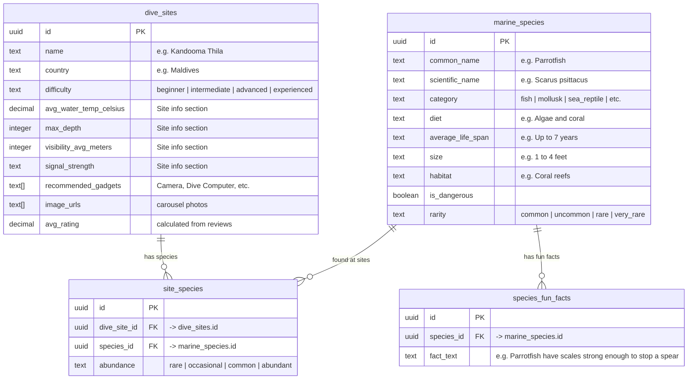
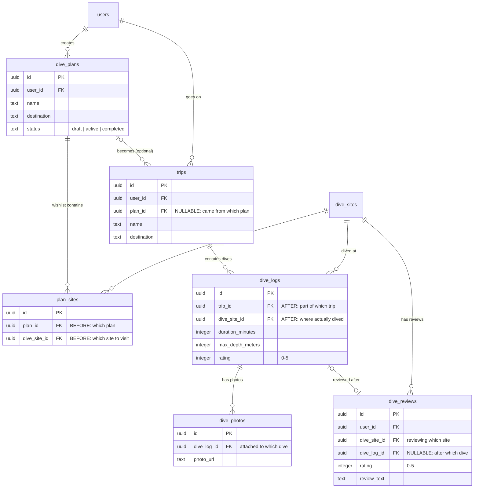
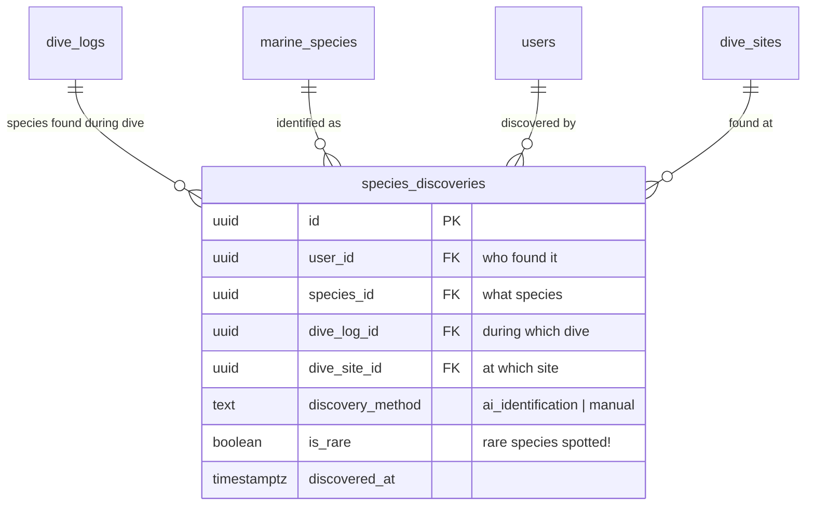
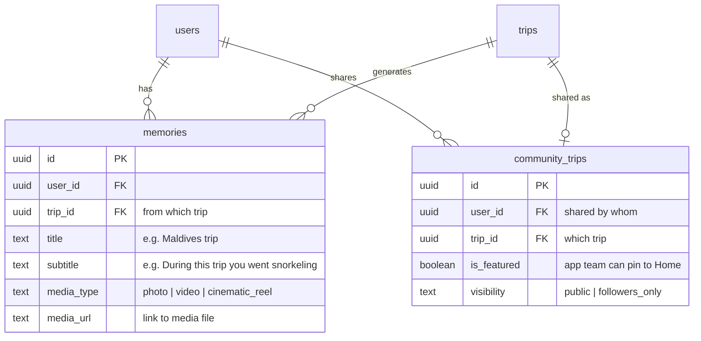
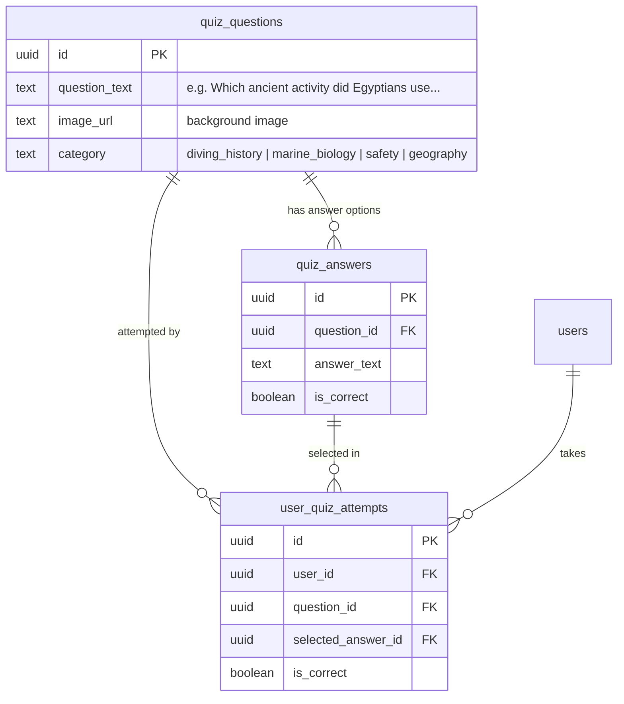

# Seafolio - Entity Relationship Diagram (ERD)

## The Dive Lifecycle: Plan -> Execute -> Remember

Before reading the ERD, understand how data flows through the app:

```
 PHASE 1: PLANNING               PHASE 2: DIVING                PHASE 3: AFTER DIVE
 (Home + Dive Plan tab)           (Start Dive tab)               (Logbook + Profile)
 ========================         ========================       ========================

 User explores Home page          User taps "Start dive"         Results saved to Logbook
          |                                |                              |
          v                                v                              v
    dive_plans                         trips                        dive_logs
    "Maldives Adventure"               "Maldives Adventure"        (one row per actual dive)
    status: planned                     linked to plan              Kandooma: 160min, 30m
          |                                |                        Tiger Port: 60min, 30m
          v                                v                              |
    plan_sites                         dive_logs                    +--> dive_photos
    (wishlist of sites)                (one per dive done)          +--> dive_reviews
    - Kandooma Thila                   - Kandooma Thila             +--> species_discoveries
    - Tiger Port                       - Tiger Port                       |
    - Banana Reef                      (skipped Banana Reef)              v
                                                                    memories
                                                                    (cinematic reel)
```
---

## Full ERD Diagram

```mermaid
erDiagram

    %% ============================================
    %% DOMAIN 1: AUTHENTICATION & USER PROFILE
    %% ============================================
    %% users = Supabase auth.users (created on signup)
    %% user_profiles = app-specific profile data (created automatically after signup)

    users {
        uuid id PK
        text email
        text phone
        text encrypted_password
        text auth_provider "email | phone | google | apple | facebook"
        timestamptz created_at
        timestamptz last_sign_in_at
    }

    user_profiles {
        uuid id PK
        uuid user_id FK "UNIQUE -> users.id"
        text display_name
        text username "UNIQUE @handle"
        text avatar_url
        text cover_photo_url
        text bio
        text badge "hobby_diver | advanced_diver | pro_diver | freediver | snorkeler"
        timestamptz created_at
        timestamptz updated_at
    }

    %% ============================================
    %% DOMAIN 2: DIVE SITES & MARINE SPECIES
    %% ============================================
    %% dive_sites = all dive spots worldwide (app content)
    %% marine_species = all known species (app content)
    %% site_species = which species are found at which sites (many-to-many)
    %% species_fun_facts = "Did you know?" cards on species detail page

    dive_sites {
        uuid id PK
        text name
        text description
        text country
        text region
        decimal latitude
        decimal longitude
        geography location "PostGIS POINT"
        text location_name "for text search"
        text difficulty "beginner | intermediate | advanced | experienced"
        text dive_type "shore | boat"
        integer min_depth
        integer max_depth
        decimal avg_water_temp_celsius "e.g. 20"
        integer visibility_avg_meters "e.g. 20"
        text signal_strength "none | weak | moderate | strong"
        text current_strength "none | mild | moderate | strong"
        text best_season
        text[] recommended_gadgets "Camera, Dive Computer, etc."
        text[] image_urls "multiple photos for carousel"
        decimal avg_rating "auto-calculated from dive_reviews"
        integer review_count "auto-calculated from dive_reviews"
        timestamptz created_at
    }

    marine_species {
        uuid id PK
        text common_name
        text scientific_name
        text category "fish | mollusk | sea_reptile | echinoderm | crustacean | coral"
        text[] image_urls "multiple photos for carousel"
        text description
        text diet "e.g. Algae and coral"
        text average_life_span "e.g. Up to 7 years"
        text size "e.g. 1 to 4 feet"
        text habitat "e.g. Coral reefs"
        boolean is_dangerous
        text rarity "common | uncommon | rare | very_rare"
        text conservation_status
        timestamptz created_at
    }

    species_fun_facts {
        uuid id PK
        uuid species_id FK "-> marine_species.id"
        text fact_text "Did you know?"
        text icon "fin | binoculars | sound | etc."
        integer sort_order
        timestamptz created_at
    }

    site_species {
        uuid id PK
        uuid dive_site_id FK "-> dive_sites.id"
        uuid species_id FK "-> marine_species.id"
        text abundance "rare | occasional | common | abundant"
        text best_season
        timestamptz created_at
    }

    %% ============================================
    %% DOMAIN 3: DIVE PLANNING (before diving)
    %% ============================================
    %% dive_plans = user's saved dive plans ("Maldives Adventure")
    %% plan_sites = wishlist of dive sites inside a plan

    dive_plans {
        uuid id PK
        uuid user_id FK "-> users.id"
        text name "e.g. Maldives Adventure"
        text description
        text destination "e.g. Maldives"
        text status "draft | active | completed"
        timestamptz created_at
        timestamptz updated_at
    }

    plan_sites {
        uuid id PK
        uuid plan_id FK "-> dive_plans.id"
        uuid dive_site_id FK "-> dive_sites.id"
        integer sort_order
        timestamptz added_at
    }

    %% ============================================
    %% DOMAIN 4: TRIPS & DIVE LOGS (during/after diving)
    %% ============================================
    %% trips = a completed dive trip (linked to plan if it started as one)
    %% dive_logs = one row per actual dive (inside a trip)
    %% dive_photos = photos attached to a dive log
    %% dive_reviews = user review + rating for a dive site after diving

    trips {
        uuid id PK
        uuid user_id FK "-> users.id"
        uuid plan_id FK "NULLABLE -> dive_plans.id (if trip started from a plan)"
        text name "e.g. Drift dives"
        text destination "e.g. Maldives"
        text country
        text cover_image_url
        decimal avg_rating "auto-calculated from dive_logs ratings"
        integer site_count "auto-calculated"
        integer dive_count "auto-calculated"
        integer species_count "auto-calculated"
        timestamptz start_date
        timestamptz end_date
        timestamptz created_at
    }

    dive_logs {
        uuid id PK
        uuid user_id FK "-> users.id"
        uuid trip_id FK "-> trips.id"
        uuid dive_site_id FK "-> dive_sites.id"
        text status "planned | active | completed"
        text dive_type "scuba_diving | snorkeling | freediving"
        text logging_method "device_sync | manual"
        text device_name "e.g. Garmin Descent G2"
        integer duration_minutes "e.g. 160"
        integer max_depth_meters "e.g. 30"
        decimal water_temp_celsius
        text visibility "poor | moderate | good | excellent"
        text description
        integer rating "0-5"
        timestamptz started_at
        timestamptz completed_at
        timestamptz created_at
    }

    dive_photos {
        uuid id PK
        uuid dive_log_id FK "-> dive_logs.id"
        uuid user_id FK "-> users.id"
        text photo_url
        text caption
        boolean is_cover
        integer sort_order
        timestamptz created_at
    }

    dive_reviews {
        uuid id PK
        uuid user_id FK "-> users.id"
        uuid dive_site_id FK "-> dive_sites.id"
        uuid dive_log_id FK "NULLABLE -> dive_logs.id"
        text review_text "max 1000 chars"
        integer rating "0-5"
        timestamptz created_at
        timestamptz updated_at
    }

    %% ============================================
    %% DOMAIN 5: SPECIES DISCOVERIES
    %% ============================================
    %% species_discoveries = species a user found during a dive
    %% Can be AI-identified (from photos/video) or manually tagged

    species_discoveries {
        uuid id PK
        uuid user_id FK "-> users.id"
        uuid species_id FK "-> marine_species.id"
        uuid dive_log_id FK "NULLABLE -> dive_logs.id"
        uuid dive_site_id FK "-> dive_sites.id"
        text discovery_method "ai_identification | manual"
        boolean is_rare
        timestamptz discovered_at
    }

    %% ============================================
    %% DOMAIN 6: MEMORIES & COMMUNITY
    %% ============================================
    %% memories = story-style media from trips (photos, cinematic reels)
    %% community_trips = trips shared publicly for other divers to see

    memories {
        uuid id PK
        uuid user_id FK "-> users.id"
        uuid trip_id FK "-> trips.id"
        text title "e.g. Maldives trip"
        text subtitle "e.g. During this trip you went snorkeling"
        text media_type "photo | video | cinematic_reel"
        text media_url
        text thumbnail_url
        integer sort_order
        timestamptz created_at
    }

    community_trips {
        uuid id PK
        uuid user_id FK "-> users.id"
        uuid trip_id FK "-> trips.id"
        boolean is_featured "app team can feature on Home"
        text visibility "public | followers_only"
        timestamptz created_at
    }

    %% ============================================
    %% DOMAIN 7: QUIZ & GAMIFICATION
    %% ============================================
    %% quiz_questions = "Which is correct?" questions on Home page
    %% quiz_answers = multiple choice answers for each question
    %% user_quiz_attempts = tracks what the user answered

    quiz_questions {
        uuid id PK
        text question_text
        text image_url
        text category "diving_history | marine_biology | safety | geography"
        text difficulty "easy | medium | hard"
        timestamptz created_at
    }

    quiz_answers {
        uuid id PK
        uuid question_id FK "-> quiz_questions.id"
        text answer_text
        boolean is_correct
        integer sort_order
        timestamptz created_at
    }

    user_quiz_attempts {
        uuid id PK
        uuid user_id FK "-> users.id"
        uuid question_id FK "-> quiz_questions.id"
        uuid selected_answer_id FK "-> quiz_answers.id"
        boolean is_correct
        timestamptz attempted_at
    }

    %% ============================================
    %% ALL RELATIONSHIPS
    %% ============================================

    %% User relationships
    users ||--|| user_profiles : "has one profile"
    users ||--o{ dive_plans : "creates plans"
    users ||--o{ trips : "goes on trips"
    users ||--o{ dive_logs : "logs dives"
    users ||--o{ dive_photos : "uploads photos"
    users ||--o{ dive_reviews : "writes reviews"
    users ||--o{ species_discoveries : "discovers species"
    users ||--o{ memories : "has memories"
    users ||--o{ community_trips : "shares trips"
    users ||--o{ user_quiz_attempts : "takes quizzes"

    %% Dive site & species relationships
    dive_sites ||--o{ site_species : "has species"
    marine_species ||--o{ site_species : "found at sites"
    marine_species ||--o{ species_fun_facts : "has fun facts"
    marine_species ||--o{ species_discoveries : "identified in"

    %% THE KEY LIFECYCLE: Plan -> Trip -> Dive Logs
    dive_plans ||--o{ plan_sites : "contains wishlist sites"
    dive_sites ||--o{ plan_sites : "wishlisted in plans"
    dive_plans |o--o{ trips : "becomes a trip (optional)"
    trips ||--o{ dive_logs : "contains actual dives"
    dive_sites ||--o{ dive_logs : "dived at"

    %% Dive log outputs
    dive_logs ||--o{ dive_photos : "has photos"
    dive_logs ||--o{ species_discoveries : "species found during"
    dive_logs |o--o| dive_reviews : "reviewed after"

    %% Content & community
    trips ||--o{ memories : "generates memories"
    trips ||--o| community_trips : "shared to community"
    dive_sites ||--o{ dive_reviews : "has reviews"

    %% Quiz
    quiz_questions ||--o{ quiz_answers : "has answer options"
    quiz_questions ||--o{ user_quiz_attempts : "attempted by users"
    quiz_answers ||--o{ user_quiz_attempts : "selected in attempts"
```



---

## Connections Explained: The Complete Chain

### How dive_plans, plan_sites, trips, and dive_logs connect:



### Real-World Example: Alfred's Maldives Trip

```
STEP 1: PLANNING (Dive Plan tab)
=================================
Alfred creates dive_plan:
  { name: "Maldives Adventure", destination: "Maldives", status: "active" }

He adds 3 plan_sites:
  { plan_id: ^, dive_site_id: "Kandooma Thila" }
  { plan_id: ^, dive_site_id: "Tiger Port" }
  { plan_id: ^, dive_site_id: "Banana Reef" }


STEP 2: START DIVE (Start Dive tab)
====================================
Alfred taps "Start dive". App creates a trip:
  { name: "Drift dives", destination: "Maldives", plan_id: ^ }

Day 1 - He dives Kandooma Thila. App creates dive_log:
  { trip_id: ^, dive_site_id: "Kandooma Thila", duration: 160, depth: 30 }

  After surfacing -> "Dive completed!" screen shows:
    species_discoveries: [Whale shark, Clown fish, Bottlenose dolphin]
    He taps "Finish dive" -> dive_reviews: { rating: 4, text: "Amazing currents!" }
    He adds dive_photos: [photo1.jpg, photo2.jpg]

Day 2 - He dives Tiger Port:
  { trip_id: ^, dive_site_id: "Tiger Port", duration: 60, depth: 30 }
  species_discoveries: [Tiger shark, Napoleon wrasse]
  dive_reviews: { rating: 5, text: "Sharks everywhere!" }

Day 3 - Bad weather. Banana Reef skipped.
  (plan_sites had 3, but only 2 dive_logs created = reality)


STEP 3: AFTER TRIP (Logbook tab)
=================================
dive_plan status -> "completed"

Logbook > Trips tab shows:
  "Drift dives" - Maldives - 2 sites - 4.5 stars

Logbook > Discoveries tab shows:
  [Whale shark, Clown fish, Bottlenose dolphin, Tiger shark, Napoleon wrasse]

Memories auto-generated:
  { trip_id: ^, title: "Maldives trip", media_type: "cinematic_reel" }

Alfred shares to community:
  community_trips: { trip_id: ^, is_featured: false }
```

---

## Domain Diagrams (Smaller, Easier to Read)

### Domain 1: User & Authentication



### Domain 2: Dive Sites & Marine Species



### Domain 3: Planning -> Execution Lifecycle



### Domain 4: Species Discovery



### Domain 5: Memories & Community



### Domain 6: Quiz & Gamification



---


